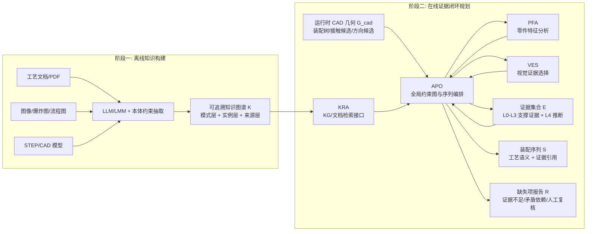
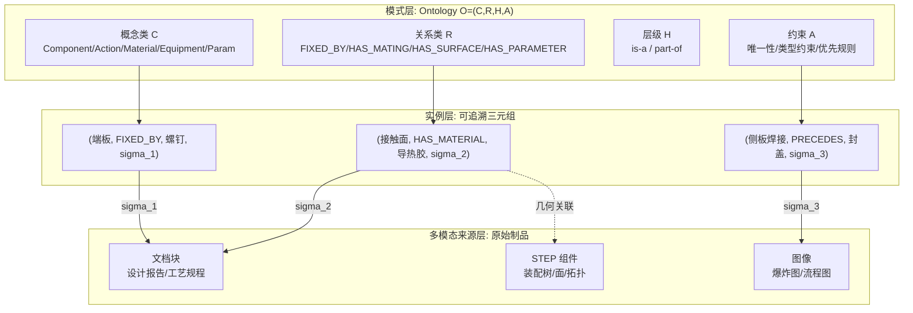
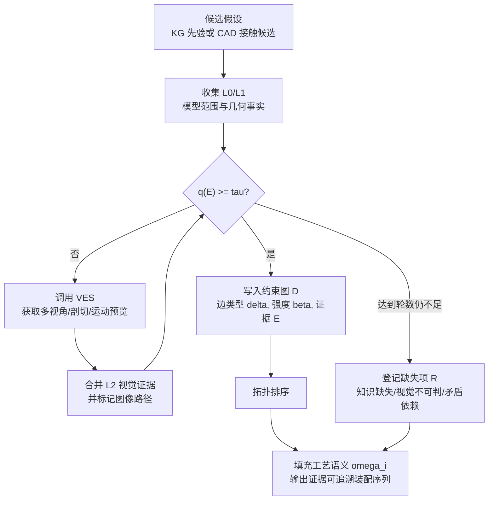
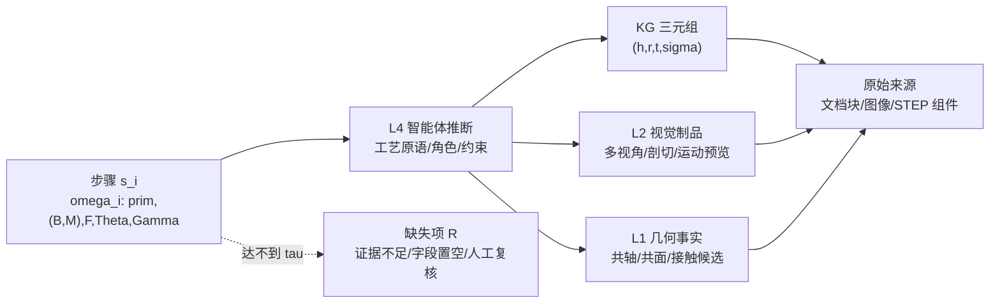

---

# 面向机械装配的知识图谱先验与多智能体证据闭环装配序列生成方法

## 1 引言

装配序列是连接产品设计与制造执行的关键工艺决策：它规定了零件以何种先后顺序、沿何种方向、通过何种工艺被装配成最终产品。在面向多品种、小批量的柔性制造背景下，装配序列的生成质量直接决定柔性装配单元能否完成自主作业。然而长期以来，装配序列规划高度依赖工艺专家的个人经验，编制周期长、可复用性差，已成为制造系统智能化升级的瓶颈环节之一。

近年来大语言模型(large language model, LLM)与多智能体系统的发展，为工艺知识解析与装配规划推理提供了新的技术路径。一种自然思路是：将产品设计文档、三维模型与图像资料作为多模态输入，使模型从中解析产品结构并生成装配序列。但这一思路在机械装配场景中仍面临三重根本障碍。

其一，几何模型存在语义不完备性。CAD/STEP 模型精确编码了零件的“形状”，却不编码“工艺意图”。两个相邻零件之间究竟是涂胶粘接、激光焊接还是过盈压合，某个配合面的姿态要求与可夹持区域如何——这些信息在设计阶段即已确定，却不存在于几何表示之中。纯几何推理无法恢复这层语义，而仅依赖大模型对三维模型的视觉判断，则容易形成缺乏外部依据的经验性推断，这是模型产生幻觉(hallucination)的重要来源。

其二，现有装配序列规划方法输出信息有限，且经验依据缺乏可追溯性。无论是基于几何可分离性的拆卸推理、基于优先关系图的图论方法，还是遗传算法、蚁群等元启发式优化，其输出大多止于零件的先后顺序(至多附带装配方向)；其所依赖的“专家经验”被固化为目标函数权重、优先约束或奖励信号等预制数学模型，是经验的数学化模拟，而非可追溯、可核验的真实经验证据。即便近期部分工作已能输出装配位姿，仍缺少一种能够同时给出配合类型、装配方式、配合面、姿态要求、可夹持面与夹持工装等成套工艺语义，并使每一条语义追踪至外部经验证据的方法。

其三，单轮大模型推理缺乏自我核实能力。装配决策本质上是“提出假设—获取证据—验证或修正”的迭代过程。让大模型一次性输出装配序列违背了这一本质：模型既无法核实自身结论，也难以在证据不足时终止推断并报告不确定性，因而可能生成表面合理但缺乏依据的结果。

由此，本文关注的核心研究问题是：如何从设计文档与多源异构的分散知识中，生成几何可行、承载经验决策、带工艺语义特征、且证据可追溯的装配序列？

为回答这一问题，本文提出一种知识图谱(knowledge graph, KG)先验与多智能体证据闭环相结合的装配序列生成方法。其基本思想是：利用知识图谱组织几何表示之外的工艺语义，并将其形式化为待验证的先验假设；再由多智能体在证据准入约束下，借助 STEP 模型的运行时几何与视觉证据对这些先验进行多轮验证、修正或否定，最终生成带工艺语义且每步证据可追溯的装配序列；当现有知识不足以支撑判断时，系统显式记录缺失证据与不可判定结论，而非强行补全。值得强调的是，本文将多智能体的价值定位在知识的规划阶段使用而非知识构建：知识图谱由离线构建流程生成，而面对运行时几何冲突、遮挡和证据不足的规划推理环节，则交由多智能体按需获取证据并协同决策——这一职责划分是本文区别于将多智能体投入构建侧的近期工作的关键。

需要强调的是，本文方法的价值并不在于“使用了大模型”，而在于：以知识图谱补充几何表示缺失的工艺语义，以证据闭环将大模型输出约束为可验证的推断。产品越复杂、特殊工艺越多，几何之外的领域语义越关键，纯几何方法与无外部约束的大模型方法的局限也越显著，本文“知识先验 + 证据验证”机制的必要性也越突出。所生成的成套装配语义，可直接为下游柔性装配单元的工步规划提供决策依据(如夹爪选择、固定方式、装配动作)。

在系统实现层面，本文将“方法角色”与“原型模块”明确区分：APO、PFA 与 VES 已在原型系统中形成可调用的智能体/工具链；KRA 作为本文方法中的知识检索角色，当前主要以知识图谱检索接口规范和论文方法设计呈现，后续实验可通过已构建图谱、文档检索或规则化查询接口实例化。换言之，本文的核心贡献不依赖于所有模块采用同一种工程实现形式，而在于建立从工艺知识、几何事实、视觉证据到装配步骤的统一证据闭环。
（需要补充的内容：第 4 章需明确 KRA 的具体实验实现方式，如 Neo4j/FAISS 查询接口、人工校核图谱检索、或文档检索替代方案；同时给出 APO/PFA/VES 的原型模块、输入输出 Schema 与运行环境，避免将“方法设计”误写为“完整工程实现”。）

本文的主要贡献如下：

1. **提出一种知识图谱先验与多智能体证据闭环相结合的装配序列生成方法，并将该任务形式化。** 我们将装配序列生成形式化为证据约束下的带工艺语义拓扑排序搜索问题(§3.1)：给定 CAD/STEP 几何、按需视觉证据与知识图谱工艺先验 $(\mathcal{G}_{cad},\mathcal{V},\mathcal{K})$，由主从编排式多智能体——装配规划编排智能体(APO)统揽全局，知识检索(KRA)、零件特征分析(PFA)、视觉证据选择(VES)三个子智能体专项取证——求解一条每步携带工艺语义与证据引用的序列，并满足拓扑可行(C1)、无碰撞(C2)、证据达阈(C3)三项约束。这将装配序列规划的目标从机加工艺路线 [Xie 2025] 推进到装配序列本身。

2. **提出模式引导、LLM/LMM 驱动、文档层证据可追溯的离线知识图谱构建流程。** 我们以本体 $O=(C,R,H,A)$(Definition 1)约束抽取，以可追溯三元组 $\hat t=(h,r,t,\sigma)$(Definition 2)将每条知识关联至其文档块、图像或 STEP 组件来源，并以精确片段定位(grounding)抑制生成式幻觉(Algorithm 1)。区别于将多智能体协同投入 KG 构建侧的近期工作(MA-APKG [Pu 2026]、KARMA [Lu & Wang 2025])，本文主张构建—规划职责解耦：构建侧的核心诉求是抽取准确性与证据可追溯性，可通过模式约束与原文定位保证；多智能体的价值应转移到面对运行时不确定性的规划阶段。

3. **形式化了一个证据—推断分层模型与一套证据驱动的多轮验证闭环。** 我们将信息区分为可直接引用的支撑证据层 $L_0$-$L_3$ 与必须被支撑的智能体推断层 $L_4$(Definition 3)，引入证据准入阈值 τ 与一组证据准入规则(如 $L_2$ 视觉证据必须有图像路径、不得仅凭名称或外观断言材料/扭矩/焊接)，并以伪代码给出验证闭环(Algorithm 2)。该机制将“幻觉抑制”转化为 KG 约束下的可满足性检验，并在知识不足时显式输出缺失项。在已核对文献范围内，尚少见将证据可追溯的运行时验证闭环用于 KG 驱动装配序列生成的工作；其证据不足时终止推断的机制提供了单轮推理所不具备的安全边界。
（需要补充的内容：投稿前需以 Web of Science/Scopus/Engineering Village/arXiv 等数据库系统检索 ASP、assembly knowledge graph、LLM agent、evidence traceability 等关键词，核实“尚少见/创新点”表述，避免使用无法证明的“首个”。）

4. **定义了工艺语义输出规范，产出步骤级可追溯的成套工艺语义。** 每步语义 $\omega_i=(\mathrm{prim},(B,M),F,\Theta,\Gamma)$(Definition 5)给出工艺原语、基座/移动件角色、配合面、姿态要求与工装要求，并与其证据 $\mathcal{E}_i$ 及来源映射 $\sigma$ 绑定，使整条序列从设计文档到装配步骤形成步骤级证据追踪。这将装配序列规划的输出从“顺序+方向”(及近期工作的位姿)推进到“成套工艺语义”，可直接为下游柔性装配单元的工步规划提供依据；后续实验章节将以锂电池模组为验证对象，报告基线对比、消融实验与多维客观指标(§4)。

本文其余部分组织如下：第 2 节梳理相关工作并定位研究缺口；第 3 节详述方法，包括问题形式化、LLM/LMM 驱动的知识图谱构建流程与多智能体证据闭环规划；第 4 节给出实验设计与结果；第 5 节讨论；第 6 节总结全文。

（需要补充的内容：若目标期刊为 Journal of Manufacturing Systems，应在引言末进一步强调该方法对柔性装配系统、工艺规划效率和人工经验复用的制造系统价值；若目标期刊为 Advanced Engineering Informatics，应强化知识表示、工具调用接口、证据追踪数据结构与智能体协同机制的工程信息学贡献。）

---

## 2 相关工作

本节从四条线索梳理相关研究：装配序列规划方法的演进、CAD 几何的语义不完备性、知识图谱与本体在装配中的应用，以及大模型与多智能体在制造规划中的最新进展。前两条揭示“问题”——装配序列规划方法本身的局限与几何表示天然缺失工艺语义；后两条考察“可能解法各自的不足”——知识图谱能够承载经验知识但缺乏完整序列推理能力，大模型具备开放式推理能力但存在幻觉风险。本文的工作正是集成二者的互补优势，以填补前两类问题所暴露的研究空白。

### 2.1 装配序列规划方法及其局限

装配序列规划(Assembly Sequence Planning, ASP)是制造领域的经典问题，已形成若干方法范式。基于几何推理的方法通过零件间的可分离性、干涉关系与方向阻挡图判定可行的拆卸/装配顺序，其几何判据可解释，但本质上只回答“能否装上”，无法表达工艺意图；且面对零件数增长时存在组合爆炸 [Wilson & Latombe 1994]。基于优先关系图、连接关系图与割集的图论方法将装配约束表示为优先关系，输出仍是顺序，且优先约束往往需人工或规则给定。元启发式优化方法(遗传算法、蚁群、粒子群等)以干涉矩阵、优先关系矩阵与代价权重为输入，搜索目标函数下的近优顺序——此处专家经验被压缩为标量目标函数与权重，是经验的数学化模拟，搜索过程为黑箱，不产出工艺语义。基于学习的方法(强化学习、图神经网络等)从装配关系图或多视图数据中学习排序策略——例如 Shu 等以图注意力网络结合延迟奖励的强化学习实现子装配到整装配的序列规划，并以物理仿真验证 [Shu et al. 2024]；近期个别工作进一步输出零件位姿与装配指令。但此类方法普遍依赖大量训练数据、奖励设计仍是经验的模拟，且端到端模型的可解释性与证据可追溯性较弱。

综上，现有 ASP 方法存在两类相互独立的局限：其一是语义贫乏——几何、优化与多数学习方法的输出止于顺序与方向；其二是经验依据缺乏可追溯性——优化与学习方法将专家经验固化为目标函数或奖励的黑箱。需谨慎指出的是，“语义贫乏”并非对所有方法成立(已有工作能输出位姿)，因此本文的精确表述是：尚无方法能够同时给出成套工艺语义，并使每条语义可追溯到经验证据。

（需要补充的内容：本小节应补齐经典 ASP 综述、几何拆卸推理、优先关系图、元启发式优化、强化学习/图学习 ASP 的代表性引用，并明确每类方法的输入、输出和评价指标；特别要核实 Wilson & Latombe 1994、Shu et al. 2024 及近期位姿级装配规划工作的正式题名、DOI/会议来源。）

### 2.2 CAD 几何的语义不完备性

本文方法的一个理论前提是：三维几何模型并不完整地编码制造所需的全部语义。这一论断在面向制造的设计(MBD)与产品制造信息(PMI)研究中有明确支撑：几何尺寸与公差(GD&T)、连接与工艺要求等信息需作为 PMI 显式嵌入三维模型(如经由 ISO 10303 STEP 标准承载)，纯几何表示本身并不包含这些内容；语义化 PMI 被进一步定义为支撑对设计意图的机器可理解表达。与此相关，CAD 模型的语义富化(semantic enrichment)与设计意图恢复(design intent recovery)研究试图从低层几何中重建高层语义 [Bonino et al. 2021]。这些工作共同印证：焊接、涂胶、紧固等工艺意图是设计阶段确定、却丢失于几何之外的语义，需要额外的知识来源加以恢复——这正是本文引入知识图谱的根本动因。

进一步说，STEP/B-rep 提供的是零件拓扑、面类型、相邻关系与局部几何约束；这些信息足以支持接触候选、共轴/共面约束和拆卸方向等几何事实，却不能单独判定连接工艺、装配介质、工装能力、质量检验要求或安全作业顺序。本文因此不把 CAD 解析结果视为完整语义来源，而将其作为运行时几何证据，与文档知识和视觉证据共同进入证据闭环。
（需要补充的内容：补充 ISO 10303/AP242、MBD/PMI 语义化以及 CAD semantic enrichment/design intent recovery 的权威引用；最好给出一个来自锂电池模组资料的真实例子，展示“几何可见但工艺不可见”的具体信息缺口。）

### 2.3 知识图谱与本体在装配中的应用

知识图谱(KG)与本体(ontology)为显式、可复用、可追溯地承载工艺知识提供了载体。已有综述指出，相较于过度依赖个人经验、难以管理复杂工艺知识的传统计算机辅助工艺规划(CAPP)，过程知识图谱(process knowledge graph, PKG)能够显式存储多模态工艺知识、揭示知识间的显隐关系并具备可解释性，被视为传统制造向智能制造转型的关键技术 [Xiao et al. 2023]。在装配领域，知识图谱已被用于复杂产品的装配资源与工艺经验复用。

在知识图谱的构建范式上，存在面向不同目标的技术路线之分。本体驱动(schema-first)路线先由专家定义本体再填充实例，推理能力强但建模周期长、对多源异构数据适应性差；文档型知识库(如基于双链 Markdown 的轻量知识库)可追溯性强、人可读易审，但仅有链接而无关系类型语义，难以支持约束推理；以微软 GraphRAG 为代表的检索增强路线 [Edge et al. 2024] 通过大模型抽取实体图并预生成社区层级摘要，其定位是面向查询的摘要(query-focused summarization)，服务于检索而非逻辑推理。对于装配序列规划而言，所需的是优先关系的传递、几何冲突的传播等可判定的约束推理，检索导向的社区摘要会损失精确约束，因而不宜作为规划的事实基础。这一区分构成本文知识图谱构建选型的依据(详见第 3 节)。

（需要补充的内容：本小节需要补充装配本体、工艺知识图谱、过程知识图谱综述以及 GraphRAG/检索增强图谱的正式引用；建议增加一张“知识承载方式对比表”，列出 schema-first KG、文档型知识库、GraphRAG 与本文可追溯 KG 在约束推理、可审计性、构建成本上的差异。）

### 2.4 大模型与多智能体的制造规划

大模型与多智能体为工艺决策提供了新范式，但也带来了幻觉这一核心挑战。在与本文最接近的工作中，Xie 等提出以多智能体协作结合知识图谱来快速生成制造工艺路线，并明确指出大模型在复杂、专业的工业场景中易产生看似合理实则错误的幻觉，而多智能体与知识图谱的结合可降低幻觉、提高可靠性 [Xie et al. 2025]。在机器人与装配侧，AssemMate 从装配工艺文档与三维模型构建装配知识图谱并以图结构注入大模型，支持装配问答与任务规划，其结果表明结构化的图注入相较纯文档注入更精确高效 [AssemMate 2025]。

在 KG 构建侧，近期工作将多智能体协同投入图谱的自动构建：MA-APKG 以多组智能体分工抽取、冲突消解与自一致性校验来建造航空装配工艺知识图谱 [Pu et al. 2026]，KARMA 以多智能体分工(抽取、对齐、消歧、验证、补全)实现知识图谱的增量富集 [Lu & Wang 2025]。但这类工作的产物是静态知识库，本身不涉及运行时几何/视觉证据，也不产出装配序列。这一观察构成本文“构建—规划职责分离”主张的直接对照：本文将多智能体从构建侧移至规划侧。

这些工作共同验证了“多智能体 + 知识图谱降幻觉”范式的可行性，但其对象多为工艺路线、机器人操作或知识库自身，尚未落到“装配序列 + 成套工艺语义 + 步骤级证据追踪”的统一输出。

（需要补充的内容：Xie et al. 2025、AssemMate 2025、MA-APKG 2026 与 KARMA 2025 的发表源、页码/编号、DOI/arXiv 号需要逐条核验；若 KARMA 无法找到可靠正式来源，应从正文和表 1 删除，或改为“相关未发表预印本/技术报告”。）

### 2.5 研究缺口与本文定位

综合上述四条线索，可从知识图谱构建方法、智能体设计、最终输出目标三个维度，将本文与最接近的若干工作对照定位(表 1)。

**表 1 本文与代表性相关工作的对照**

| 工作 | 知识图谱构建 | 多智能体角色 | 最终输出 | 证据追踪 |
| :--- | :--- | :--- | :--- | :--- |
| Xie et al. 2025 | 过程知识图谱 | 协作生成(规划侧) | 机加工艺路线 | 弱(KG降幻觉，无步骤级证据追踪) |
| AssemMate 2025 | 文档+三维模型建装配 KG | 单模型(图编码+LLM) | 装配问答/任务规划 | 无 |
| MA-APKG 2026 | 多智能体自动建装配工艺 KG | 建图(构建侧) | 静态知识图谱 | 构建侧证据追踪 |
| KARMA 2025 | 多智能体增量富集 KG | 建图(构建侧) | 静态知识图谱 | 构建侧证据追踪 |
| **本文** | **本体+LLM/LMM 离线构建流程** | **规划侧: APO+KRA+PFA+VES** | **装配序列+成套工艺语义** | **步骤级证据追踪(强)** |

（需要补充的内容：表 1 最终稿建议增加“验证对象/案例”“是否利用运行时 CAD 视觉证据”“是否输出工艺语义字段”三列，以突出本文不是一般 LLM-agent 工作，而是面向机械装配序列生成的证据闭环方法。）

由此，本文的研究缺口可表述为：现有装配序列规划方法或输出语义贫乏、或经验依据缺乏可追溯性；知识图谱方法能够承载真实经验，却缺乏从 CAD 与多源异构知识自主生成完整装配序列的推理能力；新兴的大模型/多智能体方法虽已用外部知识与多智能体协作缓解单轮幻觉，却或将多智能体用于构建侧、或尚未落到“装配序列 + 工艺语义 + 步骤级证据追踪”的统一输出；而 CAD 几何本身又存在语义不完备性。因此，如何以知识图谱提供可追溯的外部经验先验、以多智能体多轮证据推理从 CAD 与异构知识中生成带工艺语义且证据可追溯的装配序列，并为柔性装配单元的自主决策提供指导，仍是一个开放的研究缺口。本文与 Xie et al. (2025) 共享“多智能体 + 知识图谱降幻觉”的范式，但在三方面向前推进：对象从工艺路线转向装配序列、输出从单一路线扩展到成套工艺语义、机制上引入步骤级证据追踪与证据准入闭环；并相较 MA-APKG/KARMA 将多智能体的作用面从构建侧转移到规划侧。

---

## 3 方法

### 3.1 总体架构与问题形式化

本文方法以产品的 CAD/STEP 模型与多源异构设计/工艺文件为输入，输出一条装配序列 $S=\langle s_1,\dots,s_n\rangle$，其中每一步 $s_i$ 不仅给出装配哪个零件，还给出该步的成套工艺语义 $\omega_i$ 与支撑该判断的证据引用 $\mathcal{E}_i$。

**问题形式化。** 给定由 $n$ 个零件构成的产品，记零件集合 $P={p_1,\dots,p_n}$。方法输入为三元组 $(\mathcal{G}_{cad},\mathcal{V},\mathcal{K})$：$\mathcal{G}_{cad}$ 为 STEP 解析的几何信息，$\mathcal{V}$ 为按需获取的视觉证据，$\mathcal{K}$ 为知识图谱工艺语义先验。目标为求一条装配序列 $S$，每步 $s_i=(p_{\pi(i)},\omega_i,\mathcal{E}_i)$ 携带零件、工艺语义 $\omega_i$(Definition 5)与证据引用 $\mathcal{E}_i$，$\pi$ 为 $P$ 的一个排列，且满足：(C1) $S$ 是约束图 $D$(Definition 4)的拓扑排序；(C2) 每步沿声明方向无碰撞；(C3) 每步 $\omega_i$ 由满足证据准入函数 $q(\mathcal{E}_i)\ge\tau$ 的支撑证据支撑(Definition 3)。当知识不足以满足 (C3) 时，登记知识缺失项 $\mathcal{R}$。方法输出为二元组 $(S,\mathcal{R})$。装配序列生成由此被刻画为：知识图谱先验引导、运行时证据约束下的带工艺语义拓扑排序搜索问题。

**两阶段架构(图 1)。** 方法分两阶段，以“知识构建—规划使用”职责分离为基本原则。阶段一离线运行：把分散在 PDF、图像、STEP 中的知识转换为证据可追溯的知识图谱 $\mathcal{K}$。装配工艺知识天然以多源、异构、语义隐含的形态存在——以锂电池模组某子装配为例，“端板与电芯之间需涂导热胶”这一信息，可能在设计报告里是一句自然语言、在爆炸图里是一个图标、在 STEP 模型里只表现为两个面的共面约束；阶段一的职责是将同一工艺事实在不同模态中的表达归并为一条可追溯三元组。阶段二在线运行：四个规划智能体以 $\mathcal{K}$ 为先验、以 STEP 运行时几何与视觉证据为判据，推导 $S$。两阶段之所以分离，是因为构建侧主要保证抽取准确性与来源可追溯性(由本体约束与原文定位保证)，而装配推理须面对几何冲突、遮挡、证据不足等运行时不确定性，才需要多智能体按需取证。

**主从编排式多智能体。** 阶段二采用 orchestrator–specialist 范式：装配规划编排智能体(Assembly Planning Orchestrator, APO)作主智能体，知识检索(KRA)、零件特征分析(PFA)、视觉证据选择(VES)作专项子智能体。装配序列推理可分为“全局序列编排”与“局部配合取证”两类子任务：前者需统揽所有零件的依赖关系，后者聚焦局部几何与视觉证据。若交给单个大模型端到端输出，模型须在一轮内同时处理全局约束与局部配合细节，易引发上下文过载与无证据推断；本文因此令 APO 维护全局约束图并动态调度专项子智能体，KRA/PFA/VES 各自在受限上下文内完成一类取证后将结构化结果返回 APO。子智能体之间不直接通信，均经 APO 中转，使控制流确定、可复现。各智能体的角色、专属工具与输入/输出规范如表 2 所示。

**表 2 规划智能体—工具—输入/输出规范**

| 智能体 | 角色 | 专属工具/接口 | 输入 | 输出 | 原型实现状态 |
| :--- | :--- | :--- | :--- | :--- | :--- |
| **APO** | 装配规划编排(主) | `cad_get_model_summary`、`cad_get_assembly_tree`、接触/方向分析工具 | $\mathcal{G}_{cad}, \mathcal{K}$ | 序列 $S$ + 缺失项 $\mathcal{R}$ | 已实现，见 `harness` 中装配规划编排提示词与 `AssemblyPlanningResult` 输出规范 |
| **KRA** | 知识检索(方法角色) | `kg_schema_peek`、`kg_entity_resolve`、`kg_path_query` 或等价 KG/文档检索接口 | 知识需求, $\mathcal{K}$ | 可追溯三元组 $\hat T$ | 论文方法设计；当前原型尚未包含独立 KRA 子智能体，实验需以图谱/文档检索实例化 |
| **PFA** | 零件特征分析(子) | `cad_render_part_multiview` | 零件 $p_i$ | 零件特征 $\phi_i$ | 已实现，输出对齐 `PartFeatureAnalysisResult` |
| **VES** | 视觉证据选择(子) | `cad_collect_visual_evidence`、`cad_render_contact_pair_multiview`、`cad_render_move_preview` 等 | 待证结论, $\mathcal{G}_{cad}$ | 视觉证据 $e_{vis}$ | 已实现，输出对齐 `VisualEvidenceSelectionResult` |

> **图 1 总体架构**：多源异构知识 →[LLM/LMM 离线构建流程]→ 知识图谱(模式层+实例层+多模态来源层)；CAD/STEP + KG 先验(经 KRA 检索)→[APO 编排 + KRA/PFA/VES 子智能体，证据驱动多轮验证]→ 带工艺语义且证据可追溯的装配序列。

（图 1 草图绘制提示词：绘制一个左右两阶段系统架构图。左侧为“离线知识构建”，包含 PDF 文档、图像、STEP 模型三类输入，经 LLM/LMM 与本体约束进入三层可追溯知识图谱；右侧为“在线证据闭环规划”，APO 位于中心，分别调用 KRA、PFA、VES，并从 CAD 几何与 KG 先验获得证据，最终输出装配序列与缺失项报告。强调“知识构建—规划使用职责分离”和“证据闭环”。）

> **实现状态说明。** 阶段二中的 APO、PFA 与 VES 已在原型系统中实现并可运行；KRA 当前是论文方法中的检索角色与接口规范，需在实验章通过图谱查询或文档检索工具实例化。阶段一的多源预处理与文档型知识库已实现，其向模式层/实例层分离的形式化图谱与若干抽取/对齐组件为本文方法设计，部分仍在实现中。下文对“已实现”与“方法设计”予以区分。

（需要补充的内容：表 2 中的工具名称应与最终开源/附录接口保持一致；若投稿时不展示实现路径，应改写为“原型实现/方法设计”并在实验设置中说明模块可用性。）

为避免方法章与实验章功能混淆，本文在第 3 章仅将锂电池模组作为贯穿性说明案例，用于解释多源知识、几何证据、视觉证据与装配步骤之间的信息流；该案例在本章不作为有效性证据。方法有效性仍需在第 4 章通过明确的零件规模、数据来源、专家标注、基线方法、消融设置与评价指标进行验证。

### 3.2 多源异构装配工艺知识图谱构建

阶段一是一条 LLM/LMM 驱动的离线知识构建流程(非运行时智能体)，将分散的离散知识转化为语义清晰、证据可追溯的知识图谱，供阶段二按需检索。该流程形式化为映射

$$
\mathrm{KG\text{-}Pipeline}: (\mathcal{D},\ O)\to\mathcal{K},\qquad \mathcal{D}={d_{pdf},d_{img},d_{step}},
\tag{1}
$$

其中 $\mathcal{D}$ 为多源异构文件集合，$O$ 为领域本体(模式层)，$\mathcal{K}$ 为证据可追溯知识图谱。本文采用先建本体、再以本体约束抽取的自顶向下策略：本体作为模式约束，在多源整合、增量更新与长期演化中持续提供语义一致性约束，从源头保证不同来源、不同模态的知识落入同一概念体系。产出 $\mathcal{K}$ 在逻辑上分三层——模式层(本体 $O$)、实例层(可追溯三元组集合)、多模态来源层(文档块/图像/STEP 组件等不可变原始制品)。

> **图 2 证据可追溯装配工艺知识图谱三层结构**：模式层给出概念、关系与公理；实例层存储被本体约束的工艺三元组；来源层保存文档块、图像、STEP 组件等原始制品。实例层中的每条三元组必须通过来源映射 $\sigma$ 关联到来源层，供 KRA 在规划阶段返回可审计证据。

#### 3.2.1 领域本体设计

本体先于抽取定义，既为抽取提供类型与关系的取值空间，又为跨模态实体归并提供唯一性依据。

> **Definition 1(装配工艺本体)。** 装配工艺本体为四元组 $O=(C,R,H,A)$。概念类 $C$ 按四个逻辑层级组织：过程结构与上下文层(Doc、Step，承载工序时序与来源)；物理实体与作业行为层(Action、Material、Equipment、Workstation)；数据要素与信息流转层(Param、Sink)；多模态资源关联层(Image/ImageExtract、StepModel/StepComponent)。$R$ 为关系类型集合(如 HAS_CHUNK、HAS_COMPONENT、HAS_ASSEMBLY_RELATION)，$H$ 为概念层级(is-a 继承)，$A$ 为约束与公理(唯一性约束实现同名实体归并去重)。

四层划分对应装配工艺知识的内在结构：过程层承载“做什么、按何顺序”，实体层承载“用什么、对什么作业”，数据层承载“参数与信息流向”，资源层将前三层关联到可追溯的原始制品。

为便于后续实现，表 3 给出本体元素的最小投稿版本。该表并非最终本体全量清单，而是保证第 3 章方法可复现的必要骨架。

**表 3 装配工艺本体的最小可复现骨架**

| 层级 | 代表概念 | 代表关系 | 对序列规划的作用 |
| :--- | :--- | :--- | :--- |
| 过程结构层 | `Process`、`Step`、`Subassembly` | `PRECEDES`、`HAS_STEP`、`MERGED_INTO` | 生成优先边与子装配合并关系 |
| 物理实体层 | `Component`、`Surface`、`Fastener`、`Adhesive` | `HAS_COMPONENT`、`HAS_SURFACE`、`FIXED_BY`、`HAS_MATING` | 关联零件、配合面、连接方式 |
| 作业行为层 | `Insert`、`Fasten`、`Weld`、`ApplyAdhesive`、`Cover` | `USES_TOOL`、`REQUIRES_CLEARANCE`、`HAS_DIRECTION` | 填充工艺原语、姿态和工装需求 |
| 参数与资源层 | `Torque`、`CuringTime`、`Image`、`DocumentChunk`、`StepComponent` | `HAS_PARAMETER`、`SUPPORTED_BY`、`HAS_SOURCE` | 记录参数、质量约束和来源证据 |

（需要补充的内容：最终稿需给出完整本体类、关系、公理和约束清单，并提供 10-20 条来自真实资料的三元组示例；若期刊允许，可将完整 OWL/Neo4j Schema 放入附录或数据仓库。）

#### 3.2.2 知识获取与预处理

预处理把原始文件转换为可被大模型处理、且保留来源映射的中间表示，据此建立多模态来源层，按文件类型分别处理：

- **工艺文档(PDF)**：以 PyMuPDF 解析获取文本、图片与图文关联；采用递归字符分块在可控长度下保留语义关联；文本块经嵌入存入 FAISS 向量库，并在 Neo4j 建立 Document—Chunk—Image 节点结构，使后续三元组可回指具体文档块；
- **图像**：按工艺语义归为六类(装配工艺流程图、零件三维模型图、产品爆炸图、设备实物图、设备示意图、未知)，统一尺寸并编码，嵌入 FAISS，在 Neo4j 建立 Image 节点；
- **STEP 模型**：以 PythonOCC 解析，提取装配层次、零件级几何与拓扑、几何特征(圆柱面/平面)及基于几何关系的装配约束(共轴、共面)，输出结构化 JSON 并建立完整图结构。

#### 3.2.3 基于大模型的文本知识抽取

文本抽取采用本体约束下的 Schema 驱动结构化抽取，可形式化为

$$
\hat T_{text}(y)=\mathrm{LLM}\big(y\mid \mathrm{Schema}(O),\ F_{shot}\big)\ \odot\ O, \tag{2}
$$

其中 $F_{shot}$ 为少样本示例，$\odot O$ 表示本体一致性过滤。具体执行分三步。给定一个文档块 $y$(以“端板通过螺钉固定于下箱体，接触面需涂导热胶”一类描述为例〔示意〕)：(i) 将本体 $O$ 的概念类与关系类序列化为 JSON Schema，其字段直接对应 Action/Material/Equipment/Param 等概念；(ii) 以 Function Calling 让 LLM 在该 Schema 约束下把非结构化文本转化为“参数填充”，上例应产出形如 (端板, FIXED_BY, 螺钉) 与 (端板-下箱体接触面, HAS_MATERIAL, 导热胶) 的三元组；(iii) 对每个填充值施加精确片段截取——强制取值为原文连续子串，凡不能在原文定位者一律丢弃。最后经 $\odot O$ 过滤：概念类型或关系类型不在 $O$ 取值空间内者(如将材料误填入 Equipment 槽)剔除。该设计使每条三元组同时满足“类型合法(由 $\odot O$ 保证)”与“原文有据(由精确截取保证)”，抽取层不产生原文之外的实体。

#### 3.2.4 基于多模态模型的图像知识理解

图像理解采用“分类—模板引导”两阶段。先由 LMM 将图像归类(语义路由)$c=\mathrm{LMM}_{cls}(d_{img})$，再对类别 $c$ 施以特有模板抽取并经本体过滤：

$$
\hat T_{img}(d_{img})=\mathrm{LMM}\big(d_{img}\mid \mathrm{Tmpl}(c)\big)\ \odot\ O. \tag{3}
$$

不同类别触发不同抽取目标：流程图抽取步骤序列与流转关系；爆炸图/三维模型图抽取组件列表、装配顺序、几何特征与材料；设备类图像抽取主要功能、关键部件与操作注意事项。先以语义路由收敛图像类型，再在受限模板下抽取，既提升针对性，也降低跨类别的语义混淆。

#### 3.2.5 知识图谱构建流程

> **Definition 2(可追溯三元组)。** 一条可追溯三元组为 $\hat t=(h,r,t,\sigma)$，其中 $(h,r,t)$ 为本体约束下的标准三元组，$\sigma$ 为来源映射函数，$\sigma(\hat t)\to d$ 将其映射至来源(文档块、图像或 STEP 组件)。所有实例层知识构成 $\mathcal{K}={\hat t}$，以 Neo4j 图存储、FAISS 向量索引支持跨模态检索。

三类抽取结果 $\hat T_{text}\cup\hat T_{img}\cup\hat T_{step}$ 经统一的本体一致性与唯一性校验后写入实例层，每条绑定来源 $\sigma$。端到端流程如 Algorithm 1。

> **Algorithm 1 LLM/LMM 驱动的多源异构知识图谱构建**
>
> **输入**: 多源文件 $D={d_{pdf},d_{img},d_{step}}$; 领域本体 $O=(C,R,H,A)$
>
> **输出**: 证据可追溯知识图谱 $\mathcal{K}$
>
> 1:  $\mathcal{K} \leftarrow \emptyset$
>
> 2:  **for each** $d \in D$ **do**
>
> 3:       预处理: 按类型解析并建立多模态来源层节点(嵌入 FAISS)
>
> 4:       **if** $d$ 为文本 **then**  $T_d \leftarrow \mathrm{LLM}(chunks \mid \mathrm{Schema}(O), 少样本, 精确截取) \odot O$
>
> 5:       **elif** $d$ 为图像 **then**  $T_d \leftarrow \mathrm{LMM}(d \mid 分类模板) \odot O$
>
> 6:       **else** (STEP)        $T_d \leftarrow$ 几何关系转三元组(PythonOCC 解析结果)
>
> 7:       **for each** $(h,r,t) \in T_d$ **do**
>
> 8:           校验本体一致性与唯一性约束(类型合法; 去重归并)
>
> 9:           **if** 通过 **then**  $\mathcal{K} \leftarrow \mathcal{K} \cup \{(h,r,t,\sigma=d)\}$   # 绑定来源, 写入 Neo4j
>
> 10:          **else**  登记待人工复核
>
> 11: **return** $\mathcal{K}$

（需要补充的内容：Algorithm 1 需要补充具体模型版本、提示词模板、抽取 JSON Schema、人工校核规则、三元组去重策略、图谱规模统计，如节点数、关系数、文档块数、图像数、STEP 组件数，以及抽取准确率/一致性评价。）

### 3.3 主从编排式多智能体框架与智能体构建

阶段二的四个规划智能体共享统一的构建方法。各智能体基于模型上下文协议(MCP)构建：控制器经 MCP 接口调用智能体模块，智能体内部与 LLM/LMM 交互，据任务动态选择工具并分解执行，并通过结构化输出约束与多轮对话实现自我检查与迭代修正。整个规划阶段并非固定流水线，而是 APO 依任务状态按需调度子智能体的迭代过程(对应 §3.4 Algorithm 2)：APO 先建立几何范围与复杂度判断，再按子任务类型委派 KRA/PFA/VES 取证，继而综合证据推导约束图，最后拓扑排序输出序列。

原型系统中的 MCP 工具将 STEP 可视化系统转化为可被智能体调用的外部观测模块：APO 可获得模型摘要、装配树、零件列表、候选接触对与候选拆卸/装入方向；PFA 通过单零件多视图提取几何类别、装配特征与候选夹持面；VES 通过概览、多视角接触对、运动预览和剖切渲染选择最能支撑某一判断的图像证据。需要注意的是，这些工具返回的是几何事实、视觉制品或启发式候选，不等同于精确 CAD 内核约束求解、完整运动规划或工艺专家判断。因此，所有工具输出都必须进入 §3.4.1 的证据分级模型，再由 APO 决定是否采纳。

每个智能体的专家能力由三阶段提示词设计获得：(i) **角色定位**——赋予专业身份(如 APO 为“装配规划编排专家”、KRA 为“工艺知识检索专家”)，明确能力边界，从源头压缩因角色模糊引发的知识漂移；(ii) **任务依据与输入信息**——注入该子任务所需的输入数据结构(如 STEP 解析结果、本体 Schema)与工具，并以少样本示例引导抽取/推理范式；(iii) **具体任务要求**——规定输出的 JSON Schema、证据引用要求与证据准入规则(§3.4.1)。结构化输出规范承担两项功能：其一使子智能体返回的工艺知识、零件特征与视觉信息以统一格式汇入 APO 的约束推导，可被直接解析与聚合；其二强制每条结论携带其证据来源引用，使“结论—证据”绑定在数据结构层面得到保证。为评估各智能体关键输出的可靠性，本文为每个智能体的核心输出建立专家评审机制，将“人在回路”显式建模为质量环节：对低置信或证据不足的输出转入人工复核而非直接采纳。

### 3.4 装配规划编排智能体(APO): 证据闭环序列推导

APO 是规划阶段的中枢主智能体。它不直接凭直觉给出装配顺序，而是调度 MCP 工具与子智能体，综合知识图谱中的工艺先验与运行时几何/视觉证据，构建约束图并推导序列，其任务形式化为

$$
\mathrm{APO}: (\mathcal{G}_{cad},\ \mathcal{K})\to(S,\ \mathcal{R}). \tag{4}
$$

#### 3.4.1 证据—推断分层模型与证据准入

APO 推导所依据的信息来自异构来源，可信度与可溯性各不相同。为避免把模型自身判断误当成事实，本文将运行时信息组织为“支撑证据层”和“智能体推断层”：$L_0$-$L_3$ 是可被引用和复核的支撑证据，$L_4$ 是由智能体给出的推断结论，必须被 $L_0$-$L_3$ 支撑，不能单独作为证据准入依据。

> **Definition 3(证据—推断分层模型)。** 证据空间写作 $\mathcal{E}=\mathcal{E}^{sup}\cup\mathcal{E}^{inf}$，其中 $\mathcal{E}^{sup}={L_0,L_1,L_2,L_3}$ 为支撑证据层，$\mathcal{E}^{inf}={L_4}$ 为推断层。$L_0$ 为元数据事实；$L_1$ 为几何事实(装配树/包围盒/面/法向/面积/拓扑)；$L_2$ 为视觉制品(以图像路径为凭)；$L_3$ 为启发式候选(接触候选、清障/拆卸方向、阻挡件，带置信度与方法标记)；$L_4$ 为智能体推断。$L_0/L_1$ 由 STEP 解析直接给出，$L_2$ 为视觉确认，$L_3$ 明确标注为启发式而非精确求解，$L_4$ 仅能作为待检验结论进入闭环。定义证据准入函数 $q(\mathcal{E})$：当证据集中存在可追溯的 KG/文档来源且至少包含与该结论直接相关的 $L_1$ 几何事实或 $L_2$ 视觉制品时，$q(\mathcal{E})$ 达到高置信阈值；仅含 $L_3$ 或 $L_4$ 时不得达阈。

在此分层之上，APO 遵循一组证据准入规则——即“无达阈证据不采纳”的原则：不得将 $L_3$ 启发式置信度当作事实；不得将 $L_4$ 智能体推断作为自身证据；不得仅凭零件名称或外观断言功能、材料、过盈、扭矩、焊接、胶接或装配力；不得将直线拆卸方向当作完整机器人路径；不得将工具 JSON 元数据当作视觉证据($L_2$ 必须有图像路径)。形式化地，步骤 $s_i$ 的 $\omega_i$ 被赋高置信，当且仅当其证据 $\mathcal{E}_i$ 满足 $q(\mathcal{E}_i)\ge\tau$(即约束 C3)。

**表 4 运行时证据分级与可采纳规则**

| 等级 | 来源 | 典型内容 | 可支撑的结论 | 使用限制 |
| :--- | :--- | :--- | :--- | :--- |
| $L_0$ | 文件/工具元数据 | 模型名、单位、零件 ID、视图 ID | 范围确认、证据引用定位 | 不支撑任何工艺判断 |
| $L_1$ | STEP 解析几何事实 | 装配树、包围盒、面类型、法向、面积、拓扑邻接 | 零件存在、几何邻近、共轴/共面候选 | 不直接判定连接工艺 |
| $L_2$ | 可复核视觉制品 | 多视角截图、剖切图、接触对图、运动预览图 | 可见接触、遮挡、方向可视化、局部结构确认 | 必须有图像路径；不能凭外观推材料/力学属性 |
| $L_3$ | 启发式分析候选 | 接触候选、清障方向、阻挡件、置信度 | 提出待验证假设、排序候选取证优先级 | 不能当作事实，只能进入验证闭环 |
| $L_4$ | 智能体推断 | 工艺原语、角色划分、约束边、缺失项判断 | 形成最终序列和工艺语义 | 不是支撑证据；必须由 $L_0$-$L_3$ 支撑并可追溯 |

（需要补充的内容：实验章应报告每个步骤的最高证据等级、是否含有效 $L_2$ 图像、证据不足比例和人工复核比例；这将成为本文区别于普通 LLM 规划的核心客观指标。）

#### 3.4.2 约束图构建

> **Definition 4(约束图)。** 装配约束图为有向图 $D=(N,A)$，节点 $N$ 为零件或子装配，边 $A={(n_a,n_b,\delta,\beta,\mathcal{E}_{ab})}$ 表示 $n_a$ 优先于 $n_b$，$\delta$ 为依赖类型(空间前置、配合顺序、可达性保持、阻挡优先、封闭优先、子装配合并、紧固前置、工装前置)，$\beta\in{\mathrm{hard,soft}}$ 区分硬约束与软/推断约束，$\mathcal{E}_{ab}$ 为支撑证据引用。$D$ 须无环；环或矛盾依赖登记入 $\mathcal{R}$。

APO 构建 $D$ 时，依据 KRA 返回的工艺先验与运行时几何/视觉证据共同推导优先边，其优先规则源自工艺本体公理(如内部件先于封盖、定位件先于依赖件、紧固件后于被紧固件、阻挡件后于被阻挡件)。以锂电池模组为例〔示意〕，由 KRA 返回的先验“侧板与端板为焊接”与 PFA 的几何事实“端板被电芯堆遮挡”，共同生成一条硬边 (端板堆叠 ≺ 侧板焊接, δ=封闭优先, β=hard, E={L1,L2})——即焊接侧板前必须先完成端板与电芯的堆叠，否则焊枪不可达。

#### 3.4.3 证据驱动的多轮验证闭环

APO 区别于单轮大模型推理的核心，是证据驱动的多轮验证闭环：来自 $\mathcal{K}$ 的工艺先验作为待验证假设进入，被运行时几何/视觉证据反复验证、修正或否定；仅满足证据准入函数 $q(E)\ge\tau$ 的假设进入高置信结论，证据不足者降级并登记缺失项，而非强行采纳。其过程如 Algorithm 2。

> **Algorithm 2 APO 证据驱动的多轮验证闭环**
>
> **输入**: CAD 几何 $\mathcal{G}_{cad}$; KG 先验 $\mathcal{K}$; 证据阈值 τ; 最大轮数 $K_{max}$
>
> **输出**: 装配序列 $S$; 知识缺失项 $\mathcal{R}$
>
> 1:  $M \leftarrow \{model\_summary, assembly\_tree, parts\}$        # 建立 L0/L1 范围
>
> 2:  **for each** 关键零件 $p_i$ **do**  $\phi_i \leftarrow \mathrm{PFA}(p_i)$            # 委派特征分析
>
> 3:  $\hat T \leftarrow \mathrm{KRA}(知识需求, \mathcal{K})$                              # 委派检索: 可追溯工艺先验
>
> 4:  $C \leftarrow \mathrm{cad\_get\_contact\_pairs}(compact=true)$           # L3 接触候选
>
> 5:  $D \leftarrow \emptyset$; $\mathcal{R} \leftarrow \emptyset$
>
> 6:  **for each** 候选约束 $c \in (\hat T \cup C)$ **do**                  # 先验=待验证假设
>
> 7:      $k \leftarrow 0$; $E_c \leftarrow$ 收集证据(c, M)                    # L0/L1
>
> 8:      **while** $q(E_c) < \tau$ **and** $k < K_{max}$ **do**
>
> 9:          $e_{vis} \leftarrow \mathrm{VES}(claim=c, \mathcal{G}_{cad})$               # 补充 L2 视觉证据
>
> 10:         $E_c \leftarrow E_c \cup \{e_{vis}\}$; $k \leftarrow k+1$
>
> 11:     **if** $q(E_c) \ge \tau$ **then**  $D \leftarrow D \cup \{边(c,\beta,E_c)\}$  # 证据充分, 采纳
>
> 12:     **else**  $\mathcal{R} \leftarrow \mathcal{R} \cup \{缺失项(c,"证据不足",E_c)\}$         # 证据不足, 登记
>
> 13: **if** $D$ 含环 **then**  $\mathcal{R} \leftarrow \mathcal{R} \cup \{矛盾依赖\}$
>
> 14: $S \leftarrow$ 拓扑排序($D$)                                    # 满足 C1
>
> 15: **for each** 步骤 $s_i \in S$ **do**
>
> 16:     $s_i.\omega_i \leftarrow$ 工艺语义规范($s_i, \hat T, E$)              # 填充 Def.5
>
> 17:     **if** $s_i$ 无有效 L2 视觉证据 **then**  $s_i.置信\leftarrow低; \mathcal{R}\leftarrow\mathcal{R}\cup\{s_i\}$
>
> 18: **return** $(S, \mathcal{R})$

> **图 3 APO 证据驱动的多轮验证闭环**：APO 不把 KG 先验、CAD 启发式或 L4 推断直接作为结论，而是将其作为候选约束，按 L0/L1 几何事实、L2 视觉证据和可追溯来源逐级补证；证据准入函数 $q$ 达阈则写入约束图，证据不足则进入缺失项报告。

该闭环使每条工艺约束的采纳都与其证据可信度相匹配(第 11–12 行)：证据充分则采纳，不足则显式登记缺失项而非强行补全(第 12、17 行)。仍以锂电池模组为解释性案例，当 KG 中缺少“汇流排与电芯极柱的连接工艺”时，APO 取证至多得到 $L_1$ 几何接触而无法达到 τ，于是该步连接类型字段被置空并登记入 $\mathcal{R}$：缺失项(汇流排-极柱, “连接工艺缺失:KG 无三元组且视觉无法判定焊/螺接”, 现有证据=L1)，交由人工复核，而非推断为某种焊接。这是本文方法在工业场景下的安全性来源。

（需要补充的内容：Algorithm 2 需要在实验章给出阈值 τ 的设定依据、最大取证轮数 $K_{max}$、证据不足时的人工复核策略，并报告消融结果：去除 KG、去除 VES、去除证据准入规则、单智能体端到端输出四种设置下的准确率与缺失项质量差异。）

### 3.5 知识检索智能体(KRA): 本体约束下的可追溯检索

KRA 为 APO 的专项子智能体，负责将 APO 的知识需求转化为对知识图谱的结构化查询，并返回证据可追溯的工艺先验，其任务形式化为

$$
\mathrm{KRA}: (\text{need},\ \mathcal{K})\to\hat T,\qquad \hat T={\hat t_1,\dots,\hat t_m}. \tag{5}
$$

需要特别说明的是，KRA 在本文中首先是一个方法角色：它规定 APO 如何把开放式工艺需求转化为可追溯、类型受限、可审计的知识检索结果。当前原型尚未包含独立 KRA 子智能体，因此本文在工程表述上不将其描述为已完成模块；后续实验可通过 Neo4j/FAISS 工具、文档检索器或人工校核图谱检索来实例化该角色。这样的写法能保持方法完整性，同时避免将尚未实现的检索智能体误写为原型事实。

不同于将大子图一次性注入上下文的检索增强方式(社区摘要会损失精确约束，冗余子图也不利于证据追踪)，KRA 采用模式引导、本体约束下的类型化检索，分三步执行：(i) **模式层引导**——以 kg_schema_peek 读取本体 $O$ 作为查询约束，将开放式需求 need 映射为本体上的查询计划，收敛为类型受限的检索目标；(ii) **入口实体定位**——以 kg_entity_resolve 在实例层定位种子实体，借 FAISS 语义检索处理同义/别名表述，并以本体唯一性约束完成“模糊名→标准实体”消歧；(iii) **类型化多跳遍历**——以 kg_path_query 自种子实体出发，仅沿本体允许的关系类型作多跳路径检索(Neo4j Cypher)，按需扩展邻域并逐跳返回三元组，每跳经 $\sigma$ 关联其来源。例如，为获取某两零件的配合工艺，KRA 以一条受类型约束的查询 `MATCH (a:Component)-[r:HAS_MATING]->(b:Component) ...` 自种子零件出发遍历，返回带来源的配合三元组。KRA 严格遵守证据使用规则：仅返回图谱中实际存在的三元组及其来源，不得生成式补全图谱中不存在的关系；当查询计划在图谱中无匹配路径时，返回空集并标注为知识缺失项，交由 APO 处理(Algorithm 2 第 12 行)，而非臆测。

（需要补充的内容：若后续实现 KRA，应补充查询计划 JSON Schema、Cypher 模板、实体消歧规则、空结果返回格式和检索正确率评价；若投稿时仍未实现，应将本小节标题改为“知识检索角色与接口规范”，并在实验中说明检索结果由何种工具或人工校核提供。）

### 3.6 零件特征分析智能体(PFA): 单零件装配特征提取

PFA 为 APO 的专项子智能体，负责对单个零件做稳定、可追溯的装配特征提取，其任务形式化为 $\mathrm{PFA}:p_i\to\phi_i$。PFA 仅调用一次 `cad_render_part_multiview`(返回 8 视角图像 + `compactPart` 几何统计)，据此并行分析五类特征并汇总为结构化特征向量 $\phi_i$：几何类别(plate/disk/shaft/block/ring/fastener_like/...)、装配特征(hole/through_hole/cylindrical_surface/planar_surface/thread_like/...)、对称性与方向性、候选面(候选夹持面/装配面/支撑面/需避免接触面)、装夹策略推断(候选夹持器/工装类别)。PFA 严格遵守证据规则：`compactPart` 的平面/圆柱面统计仅作 `mesh_heuristic`；不得仅凭图片断言材料、磁性、刚度、公差、装配力或螺纹标准，此类信息无外部输入时必须登记为“不确定信息”而非事实。

PFA 的输出不是最终工艺判断，而是 APO 构造 $\omega_i$ 的局部特征输入。例如，候选圆柱面和同轴孔可为“轴孔插入/螺纹紧固”提供几何候选，平面和外轮廓可为“堆叠/封盖”提供候选配合面，夹持面和避免接触面可进入 $\Gamma$ 字段形成下游工装约束。所有这些结论都保留为候选特征，只有在 APO 综合 KRA 工艺先验与 VES 视觉证据后才转化为高置信工艺语义。

（需要补充的内容：实验章应给出 PFA 在典型零件上的输出示例，如端板、侧板、汇流排、紧固件等，并由专家标注几何类别、候选面和夹持面是否正确；建议报告特征字段准确率或人工评分。）

### 3.7 视觉证据选择智能体(VES): 最小上下文取证

VES 为 APO 的专项子智能体，职责是以尽量少的上下文，为某一待证结论捕获并筛选最具信息量的视觉证据，其任务形式化为 $\mathrm{VES}:(\text{claim},\mathcal{G}_{cad})\to e_{vis}$。VES 按目标类型选择工具策略：概览用 `cad_collect_visual_evidence(mode=overview)`；接触对用 `cad_render_contact_pair_multiview`(隔离两零件并以红色高亮候选接触面)；拆卸/装入方向用 `cad_render_move_preview`(仅在方向假设已提出时)；隐藏界面用 `cad_collect_visual_evidence(mode=section_sweep)` 扫掠剖切。其选择准则为：目标零件/接触面可见、运动方向可见、遮挡低、构图完整、视图状态干净、且图像确实支撑结论；若无有用图像，则将证据置空并给出重拍建议，而非强行引用。由于视觉工具共享 viewer 状态，VES 串行调用，并在每次独立取证前以 `cad_reset_view_state` 复位。

VES 的关键价值在于把模型可视化结果转化为可引用、可复核的视觉证据。它不负责解释所有视觉语义，也不凭图像推断材料、焊接方式或力学属性；其职责是为 APO 的具体判断选择最小充分视图，并说明该图像支撑了什么、不支撑什么。例如，对于“零件 A 沿 +Z 可装入零件 B”的判断，VES 可返回运动预览图和剖切图，用于确认局部遮挡与运动方向；但若图像无法显示内部配合，则必须返回低质量证据与重拍建议。

（需要补充的内容：应在方法或实验附录中放入 3-5 个 VES 证据样例，包括成功证据、低质量证据和重拍建议；每个样例需给出图像路径、目标 claim、证据质量和 APO 最终处理结果。）

### 3.8 带工艺语义且证据可追溯的装配序列输出

经 §3.4–§3.7 中四个智能体的协同，阶段二最终产出 §3.1 所定义的目标——一条带工艺语义且每步证据可追溯的装配序列 $S=\langle s_1,\dots,s_n\rangle$。这一输出并非任一单个智能体的产物，而是整条规划闭环的综合结果：每步的序关系由 APO 的约束图 $D$ 与拓扑排序确定(§3.4)，而每步的成套工艺语义 $\omega_i$ 则整合了 KRA 检索的工艺先验(配合类型、连接工艺)、PFA 提取的零件特征(候选配合面与夹持面)与 VES 捕获的视觉确认(姿态与空间可达)，由 APO 据 Algorithm 2 第 16 行填充并绑定支撑证据。换言之，序列的顺序结构与每步的语义属性($\omega_i$)由系统分工产生，本节统一刻画后者的结构与其证据追踪方式。

每步 $s_i=(p_{\pi(i)},\omega_i,\mathcal{E}_i)$ 遵循统一的结构化模式：$p_{\pi(i)}$ 为该步装配的零件，$\omega_i$ 为其工艺语义规范，$\mathcal{E}_i$ 为支撑 $\omega_i$ 的证据引用集合。其中 $\omega_i$ 的形式化定义如下。

> **Definition 5(工艺语义规范)。** 步骤 $s_i$ 的工艺语义为五元组 $\omega_i=(\mathrm{prim},(B,M),F,\Theta,\Gamma)$：
> - $\mathrm{prim}$ 为工艺原语(平面配合、圆柱插入、轴孔插入、螺纹紧固、堆叠、封盖等)，刻画该步以何种装配动作完成；
> - $(B,M)$ 为基座件/移动件角色划分，区分该步中保持固定的基体与被装入的运动件(对应“基体加移动件”或“同时对接”)；
> - $F$ 为配合/支撑/对齐面引用，指向参与该步配合的具体几何面；
> - $\Theta$ 为姿态要求(接近方向、插入轴、旋转轴及姿态约束)；
> - $\Gamma$ 为工装要求(候选夹持器、夹持面、需保持清空的面、所需能力及尚缺的外部输入)。

工艺语义规范使每步输出从传统 ASP 的“零件顺序 +(至多)装配方向”，扩展为一组可直接支持下游决策的成套工艺意图。

**步骤级证据追踪。** $\omega_i$ 的每一字段并非孤立断言，而是经证据引用 $\mathcal{E}_i$ 与来源映射 $\sigma$ 关联至其原始依据，构成一条可逐级核验的证据链。以锂电池模组某紧固步为解释性案例(具体以实际产品为准)，其工艺原语字段可沿如下路径追踪：

$$
\underbrace{\omega_i.\mathrm{prim}=\text{螺纹紧固}}_{\text{语义结论}}
\xrightarrow{\ \mathcal{E}_i\ }
\underbrace{{L_2:\text{img_023},\ L_1:\text{共轴约束}}}_{\text{运行时证据}}
\xrightarrow{\ \text{KRA}\ }
\underbrace{(\text{端板},\text{FIXED_BY},\text{螺钉})}_{\text{KG 三元组}}
\xrightarrow{\ \sigma\ }
\underbrace{\text{设计报告 §4.2}}_{\text{文档来源}}
$$

即“该步为螺纹紧固”这一结论，既由运行时的视觉制品($L_2$)与几何共轴约束($L_1$)在证据准入规则下确认，又可经 KRA 返回的可追溯三元组、再经来源映射 $\sigma$ 追踪至设计报告的具体段落。整条序列的每一步均如此绑定，从而实现从设计文档到装配步骤的步骤级证据追踪——这是优化与学习类方法将经验固化为目标函数/奖励黑箱所不具备的可审计性。

> **图 4 单步工艺语义的证据链草图**：每个装配步骤由 APO 输出工艺语义 $\omega_i$，其字段分别绑定几何事实、视觉制品、KG 三元组与原始文档来源；当任一字段缺少达阈证据时，该字段不被强行补全，而是进入缺失项报告。

**下游价值。** 这些字段被定位为指导下游柔性装配台/机器人规划的候选工艺意图，而非最终轨迹或确定夹具设计：$\mathrm{prim}$ 与 $(B,M)$ 指示装配动作类型与受力角色，$F$ 与 $\Theta$ 为路径与对位规划提供几何约束，$\Gamma$ 直接支撑夹爪选择与固定方式确定。由此，本文输出可桥接到柔性装配单元的具体工步规划，而无需工艺人员从零编制。

> **关于视觉理解的说明。** 装配产品的视觉理解仍是开放难题。本文不声称解决该难题，而是通过 VES、多视角/剖切渲染工具与主从编排，在证据准入规则下最大化可获取的视觉证据，并对视觉不确定步(无有效 $L_2$ 证据者)显式标记待人工复核(Algorithm 2 第 17 行)，而非强行判断。

（需要补充的内容：第 3 章定稿前建议增加一个“示例输出表”，列出 3-5 个装配步骤的 `prim`、`B/M`、`F`、`Theta`、`Gamma`、证据等级、来源和缺失项字段；该表可直接承接第 4 章实验结果。）
