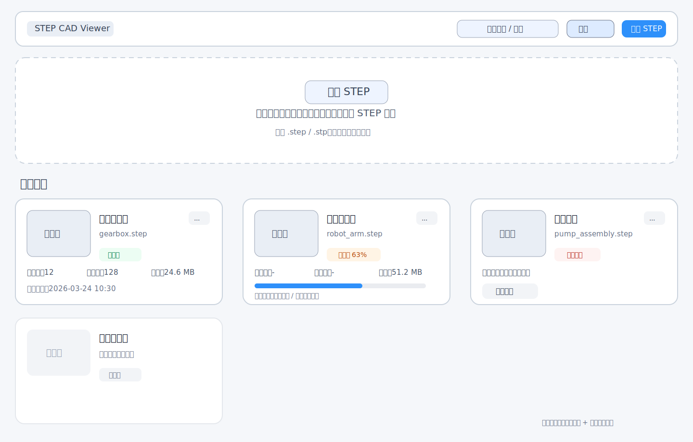
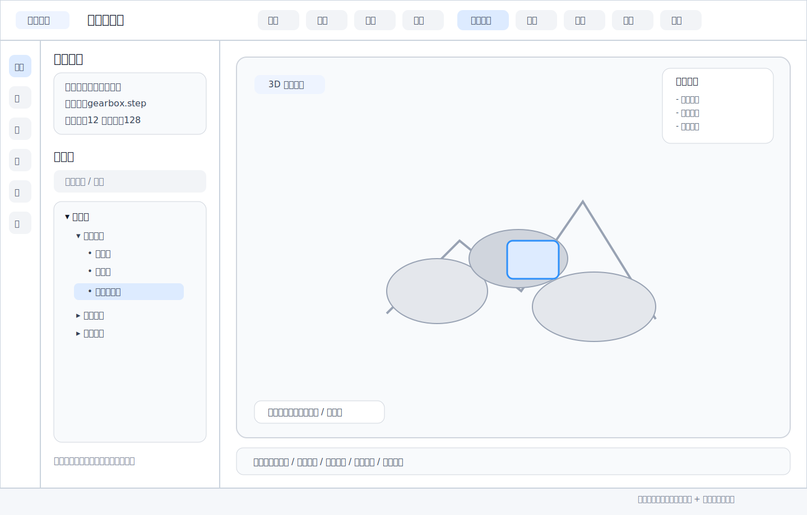

# STEP 装配模型可视化桌面软件

## 文档说明

- 文档版本：`v0.1`
- 文档类型：`MVP 产品方案 + 页面原型 + 模块清单 + 开发优先级`
- 适用形态：`桌面版（推荐 Electron + 原生 CAD 内核 Sidecar）`
- 适用对象：产品、设计、前端、客户端、CAD 内核开发

## 1. 产品目标

本软件面向装配产品 STEP 模型的导入、解析、管理与可视化查看，首版目标是完成一条完整闭环：

1. 用户启动软件后导入 STEP 装配模型。
2. 软件后台完成解析、装配树提取、BRep 处理、网格化与缩略图生成。
3. 解析完成后在首页以卡片方式展示项目。
4. 用户点击卡片进入模型工作台，进行查看、浏览、选择、测量、剖切等操作。

## 2. MVP 范围

### 2.1 首版必须完成

- STEP 文件导入
- 解析进度反馈
- 解析状态卡片展示
- 模型缩略图生成
- 项目本地缓存
- 模型工作台页面
- 装配树浏览
- 3D 模型查看
- 零件级与面级选择
- 显示/隐藏/隔离
- 基础属性查看
- 基础测量
- 单平面剖切

### 2.2 首版暂不纳入

- 爆炸图
- 干涉检查
- PMI / GD&T 深度展示
- 多模型对比
- 云端同步
- 多人协作
- 二次标注编辑

## 3. 用户主流程

```text
启动软件
  -> 进入模型中心页
  -> 上传 / 拖拽 STEP 文件
  -> 生成处理中卡片
  -> 后台解析并生成缓存
  -> 卡片状态切换为可打开
  -> 点击卡片
  -> 进入模型工作台
  -> 浏览装配 / 查看模型 / 选择对象 / 测量 / 剖切
```

## 4. 页面原型

### 4.1 页面 A：模型中心页



#### 页面定位

软件启动后的默认首页，用于导入、查看和管理已解析的装配模型项目。

#### 页面布局

- 顶部：应用标题、导入按钮、搜索框、筛选入口
- 中部：拖拽上传区
- 下方：项目卡片列表
- 卡片右上角：更多操作菜单

#### 页面核心元素

| 区域 | 内容 | 说明 |
|---|---|---|
| 顶部栏 | Logo / 软件名称 | 品牌与导航起点 |
| 顶部操作区 | `导入 STEP` 按钮 | 支持文件选择 |
| 顶部搜索区 | 项目搜索 | 支持按项目名、文件名搜索 |
| 上传区 | 拖拽文件 / 点击选择 | 首次使用时的主要入口 |
| 卡片区 | 项目卡片列表 | 展示项目状态与基本信息 |

#### 卡片字段建议

- 项目名称
- STEP 文件名
- 缩略图
- 装配数
- 零件数
- 文件大小
- 导入时间
- 解析状态

#### 卡片状态设计

- `待处理`：刚导入，尚未进入正式解析
- `解析中`：显示进度条、阶段文案、预计剩余状态
- `可打开`：可点击进入工作台
- `解析失败`：显示错误摘要，并提供重新解析入口

#### 卡片交互建议

- 单击卡片：进入工作台
- 右上角菜单：重命名、删除、重新解析、打开源文件目录
- Hover 状态：强化边框与阴影
- 解析中状态：禁止进入工作台，允许查看日志摘要

### 4.2 页面 B：模型工作台页



#### 页面定位

模型进入后的核心工作区域，用于完成装配浏览、对象选择、显示控制和分析操作。

#### 页面布局

- 左侧：导航区
- 中间：3D 主视图区
- 顶部：工具栏
- 底部：状态栏

#### 左侧导航建议结构

左侧建议采用 `图标导航栏 + 内容面板` 两段式结构，便于后续扩展功能。

| 一级导航 | 对应内容 |
|---|---|
| 项目概览 | 模型名称、文件信息、统计摘要 |
| 装配树 | 层级结构、搜索、展开、联动选择 |
| 显示控制 | 显示隐藏、隔离、透明、颜色覆盖 |
| 剖切分析 | 剖切平面开关、方向、位置 |
| 测量工具 | 距离、角度、边长 |
| 属性信息 | 选中对象基础属性 |

#### 主视图区建议

- 支持旋转、平移、缩放
- 支持框选、点选
- 支持标准视角切换
- 支持选中高亮
- 支持面级、零件级选择模式切换
- 支持剖切结果实时展示

#### 顶部工具栏建议

- 返回首页
- 适配视图
- 前 / 后 / 左 / 右 / 上 / 下视角
- 选择模式切换
- 显示全部
- 隔离选中
- 测量
- 剖切
- 截图

#### 底部状态栏建议

- 当前项目名称
- 当前选中对象名称
- 当前选择类型
- 模型零件数 / 面数摘要
- 当前操作提示

## 5. 页面原型说明

### 5.1 首页原型说明

- 视觉重点应该落在 `导入` 与 `卡片浏览` 两个任务上。
- 对首次用户，上传区应更突出。
- 对回访用户，卡片区应成为主视觉中心。
- 建议保留最近项目排序和状态筛选。

### 5.2 工作台原型说明

- 页面视觉重点应放在 `3D 主视图`。
- 左侧导航宽度建议可折叠，避免挤压视图。
- 工具栏保持轻量，复杂配置进入左侧面板。
- 选中对象后，装配树、属性面板、主视图需要同步高亮。

## 6. 模块清单

### 6.1 P0 核心模块

| 模块 | 子模块 | 功能说明 |
|---|---|---|
| 项目管理 | 项目创建 | STEP 导入后生成本地项目 |
| 项目管理 | 项目列表 | 首页卡片展示、搜索、删除、重命名 |
| 导入解析 | 文件校验 | 校验 STEP 格式、文件路径、重复导入 |
| 导入解析 | STEP 解析 | 装配结构读取、BRep 读取 |
| 导入解析 | 网格化 | 将 BRep 转为显示网格 |
| 导入解析 | 缩略图生成 | 生成卡片封面图 |
| 导入解析 | 缓存写入 | 生成项目缓存与元数据 |
| 模型查看 | 3D Viewer | 模型显示、相机控制、标准视图 |
| 模型查看 | 选择能力 | 零件级、面级选择 |
| 装配浏览 | 装配树 | 树状层级、搜索、联动高亮 |
| 显示控制 | 显示/隐藏 | 对节点进行显示控制 |
| 显示控制 | 隔离 | 仅显示选中对象 |
| 属性展示 | 基础属性 | 名称、层级路径、颜色、数量等 |
| 分析工具 | 基础测量 | 距离、角度、边长 |
| 分析工具 | 单平面剖切 | 剖切方向、位置调节 |
| 系统能力 | 日志提示 | 导入失败、解析异常、操作反馈 |

### 6.2 P1 增强模块

| 模块 | 子模块 | 功能说明 |
|---|---|---|
| 显示增强 | 透明度控制 | 半透明查看内部结构 |
| 显示增强 | 颜色覆盖 | 临时颜色标记 |
| 查询增强 | 快速定位 | 在装配树中定位当前选中对象 |
| 数据增强 | 模型统计 | 包围盒尺寸、面数、体数量摘要 |
| 交互增强 | 截图导出 | 导出当前视图截图 |
| 管理增强 | 最近项目 | 启动后快速打开最近模型 |

### 6.3 P2 后续规划模块

| 模块 | 子模块 | 功能说明 |
|---|---|---|
| 装配分析 | 爆炸图 | 装配分解展示 |
| 装配分析 | 干涉检查 | 零件干涉分析 |
| 高级标准 | PMI / GD&T | STEP AP242 深度支持 |
| 协作扩展 | 注释标记 | 模型批注与说明 |
| 数据能力 | 多格式支持 | IGES、Parasolid、JT 等 |
| 平台能力 | 云同步 | 项目上传与共享 |

## 7. 开发优先级

### Phase 1：打通主流程

目标：从导入到打开模型工作台形成闭环。

优先级最高的开发内容：

1. 首页框架与项目卡片
2. STEP 导入流程
3. 后台解析状态机
4. 项目缓存结构
5. 缩略图生成
6. 点击卡片进入工作台
7. 工作台基础布局
8. 3D Viewer 基础显示

交付结果：

- 用户可导入 STEP 文件
- 可看到解析进度
- 解析后形成卡片
- 可打开进入工作台查看模型

### Phase 2：完成核心可用性

目标：让模型工作台具备基本操作价值。

优先级内容：

1. 装配树展示
2. 装配树与视图联动
3. 选择模式切换
4. 显示/隐藏/隔离
5. 属性面板
6. 基础测量
7. 单平面剖切

交付结果：

- 用户可对装配模型进行浏览与基础分析

### Phase 3：增强体验与效率

目标：提升产品完成度与演示效果。

优先级内容：

1. 搜索与筛选
2. 最近项目
3. 颜色覆盖与透明模式
4. 视图截图
5. 更完整的错误提示
6. 性能优化与大模型加载优化

交付结果：

- 产品更适合演示、试用与小范围交付

## 8. 建议的数据结构

建议本地采用“一项目一目录”的缓存方式：

```text
project-data/
  {projectId}/
    source.step
    manifest.json
    assembly.json
    mesh.bin
    thumbnail.png
```

### manifest.json 建议字段

```json
{
  "projectId": "uuid",
  "projectName": "减速机总成",
  "sourceFileName": "gearbox.step",
  "status": "ready",
  "partCount": 128,
  "assemblyCount": 12,
  "thumbnailPath": "./thumbnail.png",
  "createdAt": "2026-03-24T10:00:00+08:00",
  "updatedAt": "2026-03-24T10:30:00+08:00"
}
```

## 9. 推荐的前后端职责划分

### Electron 前端负责

- 首页与工作台页面
- 卡片状态展示
- 路由与窗口管理
- 3D 网格渲染
- 用户交互反馈

### CAD 内核 Sidecar 负责

- STEP 解析
- BRep 读取
- 装配树提取
- 网格化
- 精确选择映射
- 测量与剖切计算
- 缓存生成

## 10. 验收清单

### MVP 验收标准

- 可成功导入一个装配型 STEP 文件
- 首页可看到项目卡片
- 卡片可正确显示解析状态
- 解析完成后可进入工作台
- 工作台可显示模型
- 装配树可展开与联动定位
- 可进行零件级选择
- 可进行面级选择
- 可执行基础测量
- 可执行单平面剖切

## 11. 后续可继续补充的内容

- 高保真 UI 设计稿
- 组件级交互说明
- 页面跳转时序图
- CAD 内核接口定义
- 前后端通信协议
- MVP 排期与人力估算

## 12. 修改建议

本文件当前更偏向 `MVP 立项稿 + 原型说明稿`，适合你继续补充：

- 品牌名称
- 页面风格偏好
- 目标行业
- 模型规模范围
- 是否需要 Windows-only 首发
- 是否需要后续支持 Web 版

